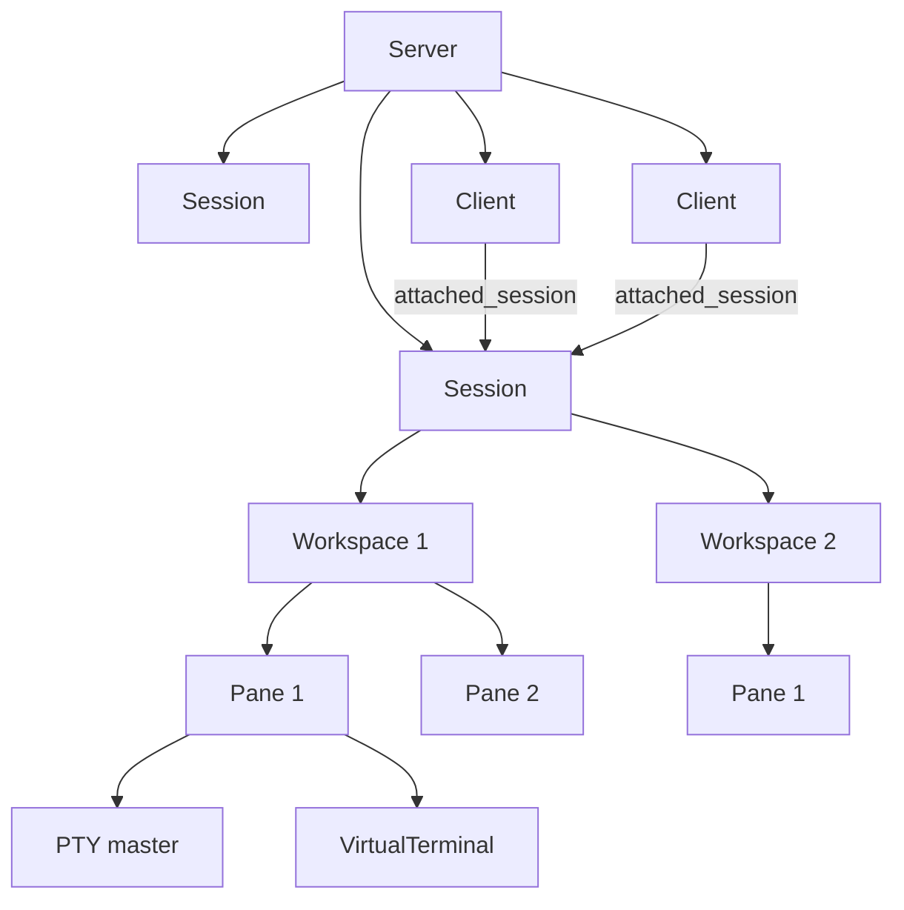
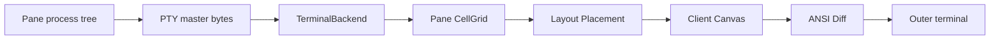
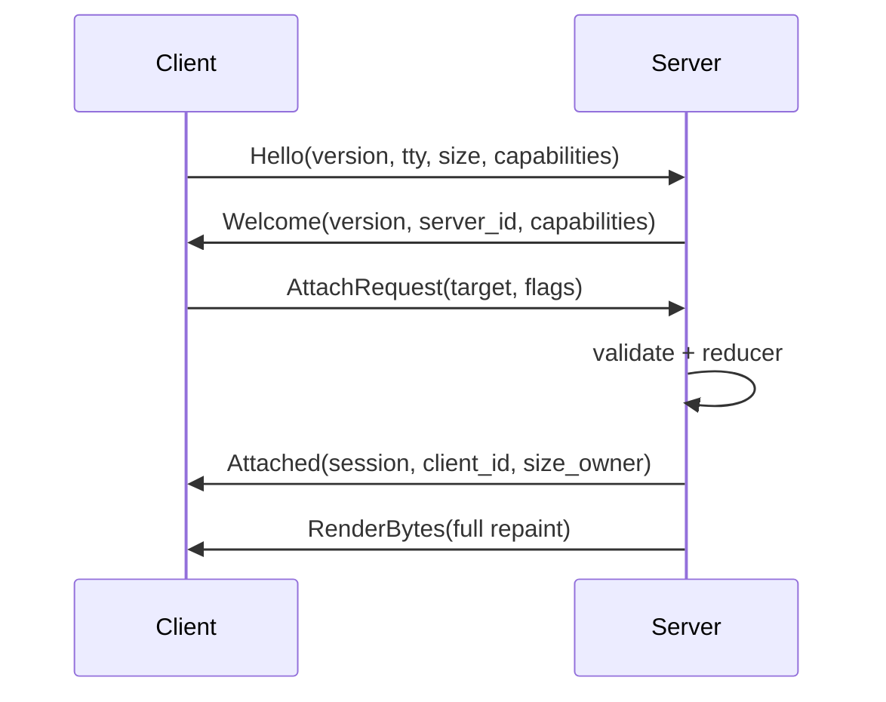

# Noren：Agent 实现规范

> **Noren is a scrolling terminal multiplexer built around horizontal workspaces.**

本文档是 Noren 首个可用版本的产品与工程事实来源，面向直接编写代码、测试和文档的开发 Agent。除非用户之后明确修改某项决定，否则本文中标记为 **MUST** 的内容不得自行改写，标记为 **SHOULD** 的内容只有在有可验证理由时才能偏离，标记为 **MAY** 的内容才是自由选择。

Noren 不是“给 tmux 换一个皮肤”，也不是“在终端里复刻 niri 的全部概念”。它借用 niri 的滚动式空间直觉，重新定义一个适合字符网格、PTY、attach/detach 和多 Client 的终端复用器。

---

## 0. Agent 使用规则

### 0.1 事实来源优先级

发生冲突时，按以下顺序处理：

1. 用户在后续对话中明确提出的新决定；
2. 本文的产品不变量与规范性要求；
3. 已接受的架构决策记录 `docs/adr/*.md`；
4. 自动化测试表达的既有行为；
5. 当前代码。

代码与本文冲突时，不得因为“代码已经这样写了”就把代码视为正确。Agent 应先确认是否有更新的 ADR 或用户决定；没有时，以本文为准。

### 0.2 Agent 不得擅自做的事

Agent **MUST NOT**：

- 引入 `Column` 层、二叉分屏树或 tmux 式 Window 层；
- 为了让 Pane 塞进屏幕而自动压缩其他 Pane；
- 把 Pane 建模成“当前前台 PID”；
- 把 Client 断开解释为 Session 或 Pane 结束；
- 让扩展直接向真实终端写 ANSI；
- 用显示编号代替稳定 ID；
- 在事件回调遍历期间立即释放仍可能被事件引用的对象；
- 使用无上限的 PTY、IPC、日志、scrollback 或控制序列缓冲区；
- 依赖 Zig 内存结构布局作为 IPC 格式；
- 在没有明确版本迁移计划的情况下跟随 Zig master。

如果任务要求改变上述内容，Agent 必须先写 ADR，并明确指出它正在改变哪一条产品不变量。

### 0.3 完成一个任务的最低标准

每个实现任务结束前必须满足：

1. `zig fmt` 通过；
2. 相关单元测试、集成测试通过；
3. Debug 构建下的模型不变量检查通过；
4. 没有新增无界队列、悬空 fd、僵尸进程或终端模式泄漏；
5. 修改行为时同步修改本规范或 ADR；
6. 最终报告列出修改的模块、验证命令和仍未覆盖的边界。

---

## 1. 产品定义

### 1.1 一句话模型

一个 Noren Server 持有若干持久 Session；每个 Session 是一列纵向排列的 Workspace；每个 Workspace 是一条横向无限延伸的 Pane 条带；每个 Pane 拥有自己的 PTY、根进程和虚拟终端；Client 可以随时 attach、detach，而不影响 Pane 中的进程。

### 1.2 基本画面

```text
──────┐┌──────────────────┐┌────────────
      ││                  ││
      ││                  ││
      ││                  ││
      ││                  ││
      ││                  ││
──────┘└──────────────────┘└────────────
22:31                        work   1:2
```

这里的三个矩形属于同一个 Workspace。相邻 Pane 即使 `gap = 0`，也保留两条独立竖边。底栏是独立 Layer，不属于任何 Pane。右侧 `1:2` 永远表示 `workspace:pane`，不是 Session、Window 或内部 ID。

### 1.3 “Noren”这个名字如何映射到模型

暖帘由同一条横向门楣下彼此分开的帘片组成。Noren 的一个 Workspace 也是一个横向整体，内部 Pane 各自独立，却共同构成一个可滚动表面。Client 离开门前并不会拆掉暖帘，这对应 detach 后 Session 仍然运行。

这个比喻只用于产品表达，不得反过来制造不必要的代码抽象。代码中使用 `Workspace`、`Pane`、`Layer` 等准确术语，不创建 `Curtain`、`Fabric` 一类装饰性模型。

### 1.4 首版支持范围

首版目标平台：

- Linux x86_64 / aarch64；
- macOS x86_64 / aarch64；
- Zig 0.16.0；
- POSIX PTY；
- Unix domain socket；
- UTF-8；
- 常见 VT220/xterm 风格 TUI；
- 外层终端以 Ghostty、Kitty、WezTerm、foot、Alacritty 和系统终端为主要兼容目标。

Windows ConPTY、远程 TCP Server、Server 重启后的进程恢复、GPU 图像协议和稳定的第三方插件 ABI 不属于首版。

### 1.5 明确的非目标

Noren 首版不是：

- 终端模拟器窗口本身；它运行在现有终端模拟器中；
- 图形窗口管理器；
- tmux 配置和命令的完全兼容实现；
- 按像素抓取其他终端画面的程序；
- 容器、进程监督器或 systemd 替代品；
- 服务器崩溃后恢复任意进程状态的检查点系统；
- 任意二维平铺布局器。

---

## 2. 产品不变量

以下编号用于代码评审、测试名和 ADR 引用。

| ID | 不变量 |
| --- | --- |
| `INV-001` | Session 包含纵向有序 Workspace；同一 Session 同一时刻只有一个 active Workspace。 |
| `INV-002` | Workspace 只包含横向有序 Pane，不存在 Column 或分屏树。 |
| `INV-003` | 每个 Pane 拥有一个 PTY 和一个 VirtualTerminal，Pane 是终端生命周期单位。 |
| `INV-004` | 新 Pane 默认插在焦点 Pane 右侧，并成为焦点。 |
| `INV-005` | 修改 Pane 宽度只改变该 Pane；其他 Pane 宽度保持不变。 |
| `INV-006` | 焦点 reveal 的水平安全边距为零，只进行最小相机移动。 |
| `INV-007` | 每个 Pane 绘制完整独立边框；`gap = 0` 时边界仍是 `││`。 |
| `INV-008` | 相机移动和可见性裁剪不得触发 PTY resize。 |
| `INV-009` | 所有 Pane 的 PTY 始终被消费，包括后台 Workspace 和完全不可见 Pane。 |
| `INV-010` | `workspace:pane` 显示编号从 1 开始，不能充当内部身份。 |
| `INV-011` | 关闭最后一个 Pane 会结束 Session；detach 最后一个 Client 不会结束 Session。 |
| `INV-012` | 外部 attach 创建 Client；应用内 attach 只切换当前 Client 的 Session。 |
| `INV-013` | 状态变更先经过 reducer，再执行 fd、signal、spawn 等 Effect。 |
| `INV-014` | attach、resize、Session 切换或输出丢帧后，Client 必须得到完整重绘。 |
| `INV-015` | Layer 只能提交结构化 Cell/Span/Action，不能绕过 Compositor 写 ANSI。 |
| `INV-016` | 所有 IPC、PTY 写队列、scrollback 和控制序列都有硬上限。 |
| `INV-017` | 一个 Session 只有一个 size owner；非 owner Client resize 不改变 PTY 尺寸。 |
| `INV-018` | Pane 环境不能暴露虚构的唯一 `NOREN_CLIENT_ID`。 |
| `INV-019` | 默认阻止 Noren 在自身 Pane 中意外启动第二个交互层；显式嵌套使用不同 socket namespace。 |
| `INV-020` | Client 无论正常退出、崩溃还是 SSH 断线，都走同一条 Server detach 清理路径。 |

Debug 和测试构建 **SHOULD** 在每批 Action 后运行 `assertInvariants()`。ReleaseFast 可以关闭高成本检查，但不能删除对应代码。

---

## 3. 核心术语与所有权

### 3.1 对象关系



Server 是所有持久运行状态的唯一所有者。真实终端由 Client 进程持有；Server 内保存与该连接对应的 `ClientState`，用于 Session 关联、Canvas、上一帧和输出队列。

### 3.2 各对象职责

#### Server

Server 拥有：

- Sessions、Workspaces、Panes；
- Clients 的服务端状态；
- PTY master fd；
- 子进程和 process group 元数据；
- VirtualTerminal；
- reactor、timer、signal 和 IPC；
- reducer 与 Effect 执行器；
- 日志和资源限额。

Server 不得依赖某个 Client 一直在线。

#### Session

Session 表示一组共同导航和共同布局的工作环境，拥有：

- Workspace 的纵向顺序；
- `active_workspace`；
- attach 的 Client 集合；
- `size_owner`；
- 规范工作区高度；
- Session 名称、创建时间和最近活动时间；
- Session 级 Layer。

可写 Client 共享 Session 的 active Workspace、Pane 焦点和 `camera_x`。这意味着两个可写 Client 同时操作同一 Session 时会看见彼此的导航变化；所有 Action 在单线程 reducer 中按到达顺序串行化。

#### Workspace

Workspace 拥有：

- Pane 的横向顺序；
- `focused_pane`；
- `camera_x`；
- 稳定 `WorkspaceId`。

Workspace 没有 `world_y`。纵向只是 Session 的 Workspace 顺序，不参与同一帧中的二维合成。

#### Pane

Pane 拥有：

- 一个根进程；
- 一个 PTY master；
- 一个 VirtualTerminal；
- 固定的外部宽度 `outer_width`；
- 当前内容行列；
- scrollback；
- 标题、工作目录提示和退出状态。

Pane 不等于任意 PID。shell 启动 Neovim 后，Pane 仍然属于同一个根终端会话；Agent 不得给 shell 的每个子进程创建新 Pane。

#### Client

Client 是一个真实终端连接。客户端进程负责：

- 保存和恢复真实终端 termios；
- 进入/退出 alternate screen；
- 读取真实终端输入；
- 与 Server 协商尺寸和能力；
- 把 Server 发送的 ANSI patch 写入真实终端；
- 在 Server 或 IPC 异常时恢复终端。

Server 侧 `ClientState` 负责：

- `attached_session`；
- read-only、size-owner 等 flag；
- Canvas 双缓冲；
- Client 尺寸；
- 输出队列和 full-redraw 标记；
- Client-local UI，例如 copy-mode viewport。

#### Layer

Layer 是 Noren 自己的 UI 表面。状态栏、命令区、Session 选择器、通知和补全列表都是 Layer，不属于 Pane 的 VirtualTerminal。

Layer 有 Session scope 和 Client scope。前者是所有 Client 共享的 Session UI，后者只存在于一个 Client，例如该 Client 正在使用的命令区。

### 3.3 稳定 ID 与显示编号

所有持久对象使用单调递增的 `u64` ID；同一 Server 进程中 ID 不复用：

```text
SessionId    s12
WorkspaceId  w42
PaneId       p91
ClientId     c7
LayerId      l3
```

显示编号由当前位置临时计算：

```text
内部身份：WorkspaceId(w42), PaneId(p91)
状态显示：1:2
```

数组重排、Pane 关闭或 Workspace 删除可以改变显示编号，但不能改变稳定 ID。异步事件只能携带稳定 ID，不能携带裸数组索引或可失效指针。

---

## 4. 已确定的交互语义

### 4.1 Workspace 与 Pane

- 左右移动：只在当前 Workspace 内切换 Pane；
- 上下移动：只切换 Workspace；
- 新 Pane：默认插在焦点右侧；
- 新 Workspace：默认插在当前 Workspace 下方，并立即创建一个 Pane；
- 空 Workspace：不作为持久对象存在；
- 某 Workspace 最后一个 Pane 关闭而其他 Workspace 仍有 Pane：删除该 Workspace，并聚焦相邻 Workspace；
- Session 最后一个 Pane 关闭：结束 Session；
- 首版不提供“创建一个长期空 Workspace”的语义；
- 首版不提供无确认的 `kill-workspace`；若以后加入，必须明确会结束其中全部 Pane。

### 4.2 Pane 宽度

Pane 宽度以字符 cell 为单位保存为绝对值：

```text
outer_width = 左边框 + 内容列 + 右边框
logical_cols = max(1, outer_width - 2)
```

首版只把绝对 cell 数写入模型。`1/2`、`2/3` 等比例命令可以存在，但执行时根据发起 Client 的可用宽度计算一次绝对值，不能把比例长期保存到 Pane。

最小合法外宽为 `3`。不存在“为了安全而给左右保留额外边距”的限制。

### 4.3 Session 共享视图与多 Client

Session 的 active Workspace、Workspace 的 focused Pane 和 `camera_x` 是共享状态。Client 的真实终端尺寸、Canvas、copy-mode 滚动位置和临时弹层焦点是 Client-local 状态。

每个 Session 只有一个 size owner：

1. 第一个 attach 的可写 Client 成为 owner；
2. 后续普通 attach 不抢 owner；
3. `attach -d` 在 detach 其他 Client 后成为 owner；
4. `:take-size` 可以显式取得 owner；
5. owner detach 后，选择最近活动的可写 Client；
6. 没有可写 Client 时保留最后规范尺寸，不 resize PTY；
7. 之后第一个可写 Client attach 时成为 owner，并应用自己的尺寸。

非 owner Client 调整真实终端大小，只重建自己的 Canvas。若它比规范工作区小，则裁剪；若更大，则多余区域填充背景。它不得引发 `TIOCSWINSZ`。

Read-only Client 永远不能成为 size owner。它只允许 detach、切换 Session，以及滚动 copy mode 等 Client-local 操作；任何会修改共享 Session、Workspace、Pane 或 Session-scope Layer 的 Action 都必须被拒绝。

### 4.4 关闭策略

“关闭 Pane”是异步状态机，不是立刻 `free()`：

```text
running
  → closing_hup
  → closing_term
  → closing_kill
  → draining
  → closed
```

默认策略：

1. 向根 process group 发送 `SIGHUP`；
2. 1 秒后仍存在则发送 `SIGTERM`；
3. 再等待 2 秒仍存在则发送 `SIGKILL`；
4. 继续读取 PTY 至 EOF 或短暂 drain deadline；
5. 注销 fd，删除 Pane；
6. 根据剩余 Pane 数删除 Workspace 或 Session。

所有 deadline 必须进入 reactor timer，不得阻塞 sleep。已经 daemonize 并脱离该终端 session 的进程不保证被 Noren 结束；Noren 不是通用 cgroup/process supervisor。

---

## 5. CLI 与应用内命令

### 5.1 可执行文件与路径

```text
程序名             noren
配置               $XDG_CONFIG_HOME/noren/config.toml
Linux runtime      $XDG_RUNTIME_DIR/noren/
macOS fallback     $TMPDIR/noren-$UID/
状态与日志         $XDG_STATE_HOME/noren/
terminfo           noren-256color
```

若对应 XDG 变量不存在，使用规范的用户目录 fallback。runtime 目录必须仅当前用户可访问。

### 5.2 外部 CLI

首版规范命令：

```text
noren new [-d] [-s NAME] [-c DIR] [-- COMMAND...]
noren attach [-d] [-r] -t TARGET
noren new -A -s NAME [-- COMMAND...]
noren list-sessions
noren list-clients [-t SESSION]
noren detach-client -t CLIENT
noren kill-session -t SESSION
noren has-session -t SESSION
noren server
noren reset-terminal
noren version
```

允许别名：

```text
new-session     → new
attach-session  → attach
ls              → list-sessions
```

行为约定：

- `noren new` 创建 Session 和首个 Workspace/Pane；
- 不带 subcommand 的 `noren` 等价于 `noren new`；
- 不带 `-d` 时，新建后在当前真实终端创建 Client 并 attach；
- `-d` 只创建，不 attach；
- `attach` 的目标必须存在；
- `new -A -s NAME` 表示存在则 attach，不存在则创建；
- `attach -d` 先 detach 目标 Session 的其他 Client；
- `attach -r` 创建 read-only、ignore-size Client；
- TARGET 先匹配稳定 ID，再精确匹配名称；首版不做模糊前缀猜测；
- 目标不存在或名称歧义必须返回非零退出码和可操作错误信息。

建议退出码：

| 退出码 | 含义 |
| --- | --- |
| `0` | 成功 |
| `1` | 一般运行错误 |
| `2` | 参数或配置错误 |
| `3` | Server/socket 不可用 |
| `4` | 目标不存在或歧义 |
| `5` | 协议版本不兼容 |

### 5.3 应用内命令区

命令区以 `:` 打开，运行在当前 Client 上下文中。首版命令：

```text
:new-pane [-- COMMAND...]
:close-pane
:resize-pane +N|-N
:set-pane-width N
:focus-pane left|right

:new-workspace
:focus-workspace up|down

:sessions
:attach SESSION
:switch-session SESSION
:detach
:take-size

:reload
:redraw
:quit
```

`:attach` 是 `:switch-session` 的用户友好别名。它把当前 Client 从 Session A 重新绑定到 Session B；Session A 继续运行。切换成功后清空该 Client 的上一帧并完整重绘。

### 5.4 默认按键

默认 prefix 为 `C-b`：

| 按键 | Action |
| --- | --- |
| `Prefix c` | 新 Pane |
| `Prefix x` | 关闭 Pane，需确认 |
| `Prefix Left/Right` | 左右 Pane |
| `Prefix Up/Down` | 上下 Workspace |
| `Prefix H/L` | 当前 Pane 宽度 `-5/+5` |
| `Prefix n` | 新 Workspace |
| `Prefix d` | detach 当前 Client |
| `Prefix s` | Session 选择器 |
| `Prefix (` / `Prefix )` | 上一个/下一个 Session |
| `Prefix :` | 命令区 |
| `Prefix r` | reload 配置 |
| `Prefix C-b` | `send-prefix` |

按键配置必须映射到结构化 Action，不能在 keybinding 中直接修改模型或写 fd。

---

## 6. 建议的数据模型

字段名可以随 Zig 实际 API 调整，但所有权和含义不得改变。

```zig
pub const Server = struct {
    sessions: IdMap(SessionId, Session),
    workspaces: IdMap(WorkspaceId, Workspace),
    panes: IdMap(PaneId, Pane),
    clients: IdMap(ClientId, ClientState),
    layers: IdMap(LayerId, Layer),

    ids: IdGenerator,
    reactor: Reactor,
    timers: TimerQueue,
    actions: ActionQueue,
    effects: EffectQueue,
    config: Config,
};

pub const Session = struct {
    id: SessionId,
    name: []const u8,
    workspaces: std.ArrayListUnmanaged(WorkspaceId),
    active_workspace: usize,
    clients: std.ArrayListUnmanaged(ClientId),
    size_owner: ?ClientId,
    canonical_outer_rows: u16,
    created_at_ns: i128,
    last_activity_ns: i128,
    state: enum { running, closing },
};

pub const Workspace = struct {
    id: WorkspaceId,
    panes: std.ArrayListUnmanaged(PaneId),
    focused_pane: usize,
    camera_x: i64,
};

pub const Pane = struct {
    id: PaneId,
    workspace_id: WorkspaceId,

    root_pid: posix.pid_t,
    process_group: posix.pid_t,
    pty: Pty,
    terminal: TerminalBackend,
    history: Scrollback,

    outer_width: u16,
    logical_cols: u16,
    logical_rows: u16,

    title: []const u8,
    state: PaneState,
    close_deadline_ns: ?i128,
};

pub const ClientState = struct {
    id: ClientId,
    connection: ConnectionId,
    attached_session: ?SessionId,
    size: Size,
    capabilities: TerminalCapabilities,
    flags: ClientFlags,

    previous_frame: CellGrid,
    next_frame: CellGrid,
    outbound: BoundedFrameQueue,
    needs_full_redraw: bool,
    last_activity_ns: i128,

    local_ui: ClientUiState,
    state: enum { handshaking, attached, detaching, closed },
};
```

### 6.1 容器与指针规则

- 模型之间只保存 ID，不保存指向可重分配 ArrayList 元素的长期裸指针；
- fd 事件注册保存 `(ObjectKind, stable_id, generation)`；
- fd 关闭后 generation 递增，迟到事件必须被丢弃；
- `deinit` 顺序由所有权树决定；
- Debug 构建应使用专门 allocator 检测泄漏；
- 不在信号处理器中分配内存。

### 6.2 Session 名称

Session 名称是 UTF-8 用户标签，不是身份。限制：

- 1 至 128 bytes；
- 不含 NUL、ASCII 控制字符、`/`；
- 同一 Server 内唯一；
- 显示时过滤会改变真实终端状态的控制字符；
- 重命名不改变 `SessionId`。

---

## 7. Action、Reducer 与 Effect

### 7.1 Action 必须包含来源

```zig
pub const ActionEnvelope = struct {
    origin: Origin,
    action: Action,
};

pub const Origin = union(enum) {
    client: ClientId,
    cli: ConnectionId,
    child_exit: PaneId,
    timer: TimerId,
    server,
};
```

需要 viewport 宽度的 Action，例如 focus/reveal，使用发起 Client 的尺寸。没有 Client 上下文的管理命令不得猜测 viewport。

### 7.2 Action 草案

```zig
pub const Action = union(enum) {
    new_pane: NewPane,
    close_pane: PaneId,
    focus_pane: Direction,
    resize_pane: i16,
    set_pane_width: u16,

    new_workspace: NewWorkspace,
    focus_workspace: Direction,

    attach_client: AttachClient,
    detach_client: ClientId,
    switch_client_session: SwitchClientSession,
    take_size_ownership: ClientId,
    client_resized: struct { client: ClientId, size: Size },

    show_layer: LayerSpec,
    update_layer: LayerUpdate,
    hide_layer: LayerId,

    child_exited: ChildExit,
    close_deadline: PaneId,
    reload_config,
    shutdown_server,
};
```

### 7.3 Effect 草案

Reducer 只更新模型并产生 Effect：

```zig
pub const Effect = union(enum) {
    spawn_pane: SpawnPane,
    resize_pty: ResizePty,
    write_pty: WritePty,
    signal_process_group: SignalProcessGroup,
    unregister_fd: FdToken,
    close_fd: posix.fd_t,
    arm_timer: TimerSpec,
    send_ipc: IpcMessage,
    disconnect_client: DisconnectClient,
    request_full_redraw: ClientId,
    write_log: LogRecord,
};
```

Reducer 不得直接 `fork`、`kill`、`ioctl`、`write` 或 `close`。Effect 失败后必须转换成新的 Action 或明确的错误事件，不能让模型假装操作已经成功。

### 7.4 关键事务顺序

创建 Pane：

```text
Action(new_pane)
  → 预留 PaneId 和模型中的 pending Pane
  → Effect(spawn_pane)
  → spawn 成功 Action(pane_spawned)
  → 注册 fd，Pane running，resize/reveal

spawn 失败
  → Action(pane_spawn_failed)
  → 删除 pending Pane，恢复焦点，显示错误 Layer
```

关闭 Pane：

```text
Action(close_pane)
  → Pane 进入 closing_hup
  → Effect(SIGHUP + timer)
  → child_exit 或 deadline Action
  → drain PTY
  → 删除 Pane
  → 删除空 Workspace 或结束 Session
```

attach：

```text
IPC AttachRequest
  → 验证身份、协议和目标
  → Action(attach_client)
  → 更新 Session.clients / Client.attached_session
  → 选择 size owner
  → needs_full_redraw = true
  → Attached + Render(full frame)
```

---

## 8. 布局与相机

### 8.1 三个坐标空间

| 坐标空间 | 含义 |
| --- | --- |
| Pane Screen | 子程序认为自己拥有的字符表面 |
| Workspace World | Pane 在横向条带中的逻辑位置 |
| Client Canvas | 某个真实终端当前能显示的 cell 网格 |

布局模块输入纯模型快照和 viewport，输出 Placement，不读取 PTY、不修改模型、不生成 ANSI。

### 8.2 横向世界坐标

对当前 Workspace：

```text
world_x[0] = 0
world_x[i + 1] = world_x[i] + outer_width[i] + gap
screen_x[i] = world_x[i] - camera_x
```

`gap` 默认是 `0`。`outer_width` 已包含左右边框。Pane 外部高度填满规范 Workspace 高度：

```text
workspace_outer_rows = max(3, size_owner.rows - session_reserve_rows)
logical_rows = workspace_outer_rows - 2
logical_cols = outer_width - 2
```

Session-scope reserve Layer 参与规范高度计算。Client-scope reserve Layer 只减少目标 Client 的可见 viewport，不改变这里的规范高度。Client 比规范高度小时只裁剪；比规范高度大时，多余区域使用 Workspace 背景。

### 8.3 新 Pane

默认：

```text
insert_at = focused_pane + 1
new_pane.outer_width = config.pane.default_width
focused_pane = insert_at
revealFocusedPane(origin_client.viewport_width)
```

其他 Pane 的宽度不得变化。右侧 Pane 仅因世界坐标累加而整体平移。

### 8.4 宽度修改

```text
new_outer_width =
    clamp(old_outer_width + delta, min_outer_width, max_outer_width)
```

只对目标 Pane 发出 PTY resize：

```text
new_logical_cols = new_outer_width - 2
ioctl(TIOCSWINSZ)
```

右侧 Pane 的 `world_x` 会改变，但它们不 resize。

### 8.5 最小 reveal

```text
viewport_left  = camera_x
viewport_right = camera_x + viewport_width

if pane_left < viewport_left:
    camera_x = pane_left
else if pane_right > viewport_right:
    camera_x = pane_right - viewport_width
else:
    camera_x unchanged
```

最后把 `camera_x` clamp 到合法范围：

```text
0 <= camera_x <= max(0, world_right - viewport_width)
```

安全边距固定为零。

### 8.6 Pane 宽于 viewport

若 Pane 自身宽于 viewport：

- 从左向右聚焦它：对齐左边框；
- 从右向左聚焦它：对齐右边框；
- 当前 Pane 变宽：尽量保持 camera，不允许完全失去与 Pane 的交集；
- 当前 Pane 变窄：clamp camera，避免在世界尾部留下无意义空白。

### 8.7 Workspace 切换

Workspace 切换只改变 Session 的 `active_workspace`。目标 Workspace 保留自己的焦点和 `camera_x`。切换本身不 resize PTY，因为所有 Workspace 使用同一个规范高度；只有 size owner 变化、size owner resize 或 Session-scope reserve Layer 高度变化才会改变行数。

### 8.8 纯函数接口

```zig
pub fn placeWorkspace(
    workspace: WorkspaceSnapshot,
    viewport: Rect,
) LayoutResult;

pub fn revealFocused(
    workspace: WorkspaceSnapshot,
    viewport_width: u16,
    direction: ?Direction,
) i64;
```

布局函数必须可在没有 PTY、Server 和真实终端的测试中运行。

---

## 9. 边框、Cell 与 Canvas

### 9.1 独立边框

每个 Pane 的完整边框由 Compositor 绘制：

```text
──────┐┌──────────────┐
      ││              │
      ││              │
──────┘└──────────────┘
```

绘制顺序：

1. 清理 `next_frame` 为 Workspace 背景；
2. 复制各可见 Pane 内容；
3. 绘制每个 Pane 完整边框；
4. 应用焦点边框样式；
5. 绘制 reserve Layer；
6. 绘制 overlay Layer；
7. 放置最终光标。

不能把相邻 Pane 的边线合并。

### 9.2 Cell

```zig
pub const Cell = struct {
    grapheme: GraphemeRef,
    width: enum(u2) { empty = 0, narrow = 1, wide = 2, continuation = 3 },
    style: Style,
    hyperlink: ?HyperlinkId,
};
```

`GraphemeRef` 可以是小字符串内联加 arena/intern fallback，但不能假设一个 cell 永远只有一个 code point。宽字符第二格必须明确标记为 continuation。

Compositor 和 Renderer 不得重新猜测 VirtualTerminal 已经决定的字符宽度。Unicode East Asian Width 不是现代终端的即插即用宽度算法；首版以 TerminalBackend 的最终 cell width 为准，并用兼容性测试约束行为。

### 9.3 裁剪宽字符

若 viewport 或 Layer 边界切过宽字符：

- 不得输出半个 grapheme；
- 起始 cell 在裁剪区外时，其 continuation cell 渲染为空白；
- 起始 cell 在区内但第二格在区外时，可以绘制替换空白，不能让下一层内容占据 continuation；
- diff run 不得从 continuation cell 开始。

---

## 10. PTY 与进程生命周期

### 10.1 平台封装

`os/pty.zig` 对 Linux 和 macOS 提供统一接口。实现可以通过 Zig `@cImport` 调用 `openpty` / `forkpty` / `login_tty`，但平台差异必须封装在 `os/` 内；核心模型不得散落 `#ifdef` 风格判断。

```zig
pub const Pty = struct {
    master_fd: posix.fd_t,
    token: FdToken,
};

pub fn spawnPty(options: SpawnOptions) !SpawnResult;
pub fn resizePty(pty: *Pty, size: Size) !void;
pub fn setNonBlocking(fd: posix.fd_t) !void;
```

### 10.2 spawn 顺序

概念顺序：

1. 创建 PTY master/slave 并设置初始 `winsize`；
2. fork；
3. 子进程建立新 session；
4. 把 slave 设为 controlling terminal；
5. slave dup 到 stdin/stdout/stderr；
6. 关闭无关 fd；
7. 设置 cwd、环境和 shell 语义；
8. exec 根命令；
9. 父进程关闭 slave；
10. master 设置 `O_NONBLOCK` 和 close-on-exec；
11. 注册 reactor；
12. 创建并初始化 VirtualTerminal。

使用 `forkpty` 时也必须理解上述语义，不得把它当作不可测试黑盒。子进程 fork 后到 exec 前只调用 async-signal-safe 操作；Server 首版保持单线程，降低 fork 复杂度。

### 10.3 默认命令

命令优先级：

1. CLI `-- COMMAND...`；
2. 配置 `pane.default_command`；
3. Session 环境中的 `SHELL`；
4. passwd entry shell；
5. `/bin/sh`。

直接传 argv，避免不必要的 `/bin/sh -c`。只有用户明确提供 shell command string 的接口才经 shell 解析。

### 10.4 Pane 环境

至少设置：

```text
TERM=noren-256color
COLORTERM=truecolor
NOREN=1
NOREN_SOCKET=<socket-path>
NOREN_SESSION=<stable-session-id>
NOREN_PANE=<stable-pane-id>
```

不得设置 `NOREN_CLIENT_ID`，因为 Pane 可能同时被多个 Client 查看。项目尚未安装自己的 terminfo 时，开发构建可以显式选择保守 fallback，但不能对外声称支持尚未实现的能力。

### 10.5 resize

仅以下情况触发 PTY resize：

- Pane `outer_width` 改变；
- size owner 的真实终端行数改变；
- Session 级 reserve Layer 总高度改变；
- size owner 转移并应用新 owner 尺寸。

以下情况绝不触发：

- `camera_x` 改变；
- Pane 进入或离开 viewport；
- Workspace 切换；
- 其他 Pane 插入、关闭或变宽；
- 非 size-owner Client resize。

### 10.6 子进程退出与 SIGCHLD

跨平台默认采用 self-pipe：

- SIGCHLD handler 只向 non-blocking pipe 写一个 byte；
- reactor 读到 pipe 后循环 `waitpid(-1, ..., WNOHANG)`；
- PID 通过 map 解析为 PaneId；
- 产生 `child_exited` Action；
- 未识别 PID 记录 warning，不 panic。

不能在 signal handler 中分配、记录格式化日志、修改 ArrayList 或执行 reducer。

### 10.7 PTY EOF

根进程退出和 PTY EOF 可能以任意顺序到达。Pane 只有在：

- 已知子进程退出或关闭状态已经完成；
- PTY 数据已 drain；
- fd 已从 reactor 注销；

之后才能释放 VirtualTerminal 和 Pane 模型。

---

## 11. VirtualTerminal

### 11.1 数据路径



Noren 不读取另一个终端模拟器的像素或“渲染后的字符串画面”。Noren 自己在 Server 中维护无头虚拟终端，外层终端只负责最终 glyph 和像素。

### 11.2 后端策略

首版使用 libvterm 0.3.3，并放在抽象接口之后。依赖必须固定版本与校验值，不能在 CI 中无版本下载 master。

```zig
pub const TerminalBackend = struct {
    pub fn init(allocator: Allocator, size: Size, callbacks: Callbacks) !TerminalBackend;
    pub fn feed(self: *TerminalBackend, bytes: []const u8) !void;
    pub fn resize(self: *TerminalBackend, size: Size) !void;
    pub fn cellAt(self: *const TerminalBackend, x: u16, y: u16) Cell;
    pub fn cursor(self: *const TerminalBackend) Cursor;
    pub fn modes(self: *const TerminalBackend) TerminalModes;
    pub fn title(self: *const TerminalBackend) []const u8;
    pub fn takeDamage(self: *TerminalBackend, out: []Rect) []Rect;
    pub fn deinit(self: *TerminalBackend) void;
};
```

未来替换 libvterm 时，`layout/`、`core/`、`server/` 和 `render/` 不应发生结构性改写。

### 11.3 最低 VT 能力

首个可用版本至少正确处理：

- UTF-8；
- cursor movement、save/restore；
- erase line/display；
- insert/delete character/line；
- scroll region；
- SGR 16/256/truecolor；
- bold、dim、italic、underline、inverse、strike；
- main/alternate screen；
- application cursor/keypad modes；
- bracketed paste mode；
- common mouse modes；
- title OSC；
- device/status 查询及对 PTY 的响应；
- soft reset 和常见 DEC private mode；
- damage；
- scrollback callbacks。

### 11.4 VT 回写

子程序发出查询后，TerminalBackend 可能需要写响应到 PTY，例如 device attributes 或 cursor position。回调不能直接阻塞写 fd，应产生 bounded `WritePty` Effect。部分写入进入 Pane input queue。

### 11.5 Scrollback

默认每 Pane 保存 10,000 行，受 Session 全局内存上限约束。主屏幕滚出内容进入 history；alternate screen 默认不进入普通 scrollback。

Copy mode 是 Client-local 视图：

- 进入 copy mode 不停止 Pane VT 更新；
- Client 看到历史快照和持续增长的底部；
- 退出后恢复实时画面并完整重绘；
- 多 Client 的 copy-mode 位置互不影响。

首版可以晚于基本 attach/detach 实现交互式 copy mode，但 TerminalBackend 接口和 scrollback 所有权必须从一开始正确。

### 11.6 高级协议

首版：

- OSC 8 hyperlink：MAY 保留为结构化 hyperlink；
- OSC 52 clipboard：默认阻止，配置允许后才转发；
- Kitty graphics / Sixel / iTerm2 images：不渲染，必须安全消费或明确忽略；
- DCS/OSC/APC 控制字符串设置长度上限；
- 不允许未知控制序列破坏 Noren 自己的 outer terminal 状态。

---

## 12. 输入系统

### 12.1 输入分层

```text
真实终端 bytes
  → Client InputDecoder
  → InputEvent + original bytes
  → PrefixRouter / Layer hit-test
  → Action 或 PaneInput
  → Server IPC
  → bounded PTY write queue
```

Legacy 模式中，非 Noren 命令按键应尽可能保留原始 bytes，避免无意义的 decode/re-encode 改变序列。需要坐标变换或现代键盘协议时才使用结构化事件重新编码。

### 12.2 Prefix 状态机

```text
normal
  ├── 非 prefix → 发给 Pane/Layer
  └── prefix → awaiting_command

awaiting_command
  ├── 已绑定键 → 产生 Action
  ├── prefix → send-prefix
  └── 未绑定键 → 显示短暂错误；默认不吞掉成串普通文本
```

prefix timeout 可配置，默认 1 秒。ESC 序列解析 timeout 默认 10ms；支持 Kitty keyboard protocol 后应优先使用无歧义编码，而不是无限增加 timeout。

### 12.3 `send-prefix`

`Prefix Prefix` 把一个原始 prefix 编码写进当前 Pane PTY，不再经过 Noren keybinding。这是嵌套 tmux/Noren 的必要能力。

### 12.4 鼠标

鼠标处理顺序：

1. 命中 Client-local overlay；
2. 命中状态栏/Layer input region；
3. 命中 Pane 边框或内容；
4. 若是 Noren 操作，生成结构化 Action；
5. 否则把 Client Canvas 坐标转换为 Pane content 坐标；
6. 根据 Pane 当前 mouse mode 编码并写入 PTY。

被裁剪 Pane 的坐标必须扣除 Placement 和边框。点击 continuation cell、viewport 外部或遮挡区域不能泄漏到错误 Pane。

### 12.5 Paste

- Client 必须识别 outer terminal 的 bracketed paste 边界；
- 若 Pane 请求 bracketed paste，则保留相应包裹；
- 超大 paste 使用有界分块和背压；
- paste 不能绕过 prefix router 形成命令注入；
- 应用内命令区与 Pane 输入拥有不同目标。

---

## 13. Server / Client 与 IPC

### 13.1 进程模型

```text
noren CLI / interactive client
           │
           │ Unix socket
           ▼
      noren server
       ├── Session A
       │    ├── Workspace 1 → Pane PTYs
       │    └── Workspace 2 → Pane PTYs
       └── Session B
```

Server 在第一次需要时启动。没有 Session 时默认退出；没有 Client 但仍有 Session 时继续运行。

### 13.2 Socket 路径和权限

Linux：

```text
$XDG_RUNTIME_DIR/noren/default.sock
```

fallback：

```text
$TMPDIR/noren-$UID/default.sock
```

要求：

- runtime 目录 mode `0700`；
- socket 不允许其他用户连接；
- Linux 使用 `SO_PEERCRED`，macOS/BSD 使用 `getpeereid` 验证 peer uid；
- 不跟随不可信 symlink；
- bind 前只删除经验证属于当前 uid 且确认已失效的旧 socket；
- socket namespace 可由 `-L NAME` 选择，但 NAME 必须净化。

### 13.3 Framing

禁止直接发送 Zig struct。每个 frame 使用固定 20-byte header：

```text
magic         4 bytes   "NRN1"
major         u16 BE
minor         u16 BE
kind          u16 BE
flags         u16 BE
request_id    u32 BE
payload_len   u32 BE
```

规则：

- 单 frame payload 上限 16 MiB；
- 控制消息 payload 使用 UTF-8 JSON；
- `InputBytes`、`RenderBytes` payload 为原始 bytes；
- JSON 未知字段在同 major 版本中忽略；
- 未知必需 message kind 返回协议错误；
- major 不同拒绝连接；
- minor 不同通过 capability 协商降级；
- parser 必须支持分片读取和多个 frame 同批到达；
- 长度、整数和 UTF-8 都必须验证。

### 13.4 消息类型

Client → Server：

```text
Hello
AttachRequest
CommandRequest
InputBytes
InputEvent
ClientResize
DetachRequest
Ping
```

Server → Client：

```text
Welcome
Attached
CommandResult
RenderBytes
Notice
Error
Detached
Pong
```

控制 CLI 复用同一协议，但不进入 alternate screen，也不创建交互 Client。

### 13.5 Handshake



在 `Attached` 前收到的 Input 必须拒绝或有界缓存，不能默默发给任意 Pane。

### 13.6 背压

Server 绝不能因为一个慢 Client 停止读取 PTY。

默认限制：

```text
每 Client outbound queue     4 MiB
每 Pane PTY input queue      1 MiB
单 IPC frame                16 MiB
单次 PTY 公平读取预算       256 KiB
Client 落后断开阈值          10 s
```

若 Client 输出跟不上：

1. 丢弃尚未发送、仅用于中间状态的 render patch；
2. 保留控制消息；
3. 设置 `needs_full_redraw`；
4. 队列恢复后发送完整帧；
5. 长时间无法恢复则 detach 该 Client。

不得丢弃 PTY bytes；它们必须先进入 VirtualTerminal。可以丢弃的是“通往某个 Client 的过时视觉差分”。

---

## 14. Attach、Detach 与嵌套

### 14.1 Detach

`:detach` 只处理当前 Client：

- 从 `Session.clients` 移除 ClientId；
- 若它是 size owner，按规则转移或保留规范尺寸；
- Server 发送 `Detached`；
- Client 恢复 termios、光标、鼠标、paste、键盘协议和 alternate screen；
- IPC 关闭；
- Pane、PTY、Workspace 和 Session 继续运行。

EOF、socket reset、Client crash 和 SSH 断线进入同一条 `detach_client` Action。清理必须幂等。

### 14.2 Attach

外部 `noren attach -t work`：

- 在当前真实终端创建新 Client；
- 连接已有 Session；
- 完成能力协商；
- 必须发送完整首帧。

应用内 `:attach work`：

- 复用当前 Client；
- 从旧 Session 移除；
- 加入目标 Session；
- 不启动第二个 UI；
- 不创建 Pane；
- 不结束旧 Session；
- 必须完整重绘。

从 Pane 内 shell 执行 `noren attach` 不等于应用内 `:attach`。Pane 可能同时被多个 Client 查看，因此 shell 环境没有唯一“当前观看者”；CLI 不得猜一个 Client 进行切换。用户应在 Noren 命令区执行 `:attach`，管理脚本若以后需要切换 Client，则必须显式提供 `ClientId`。

### 14.3 运行在 tmux 中

Noren 运行在 tmux Pane 内时，tmux 是外层终端复用器，Noren 是普通 TUI。tmux 的前缀先得到按键；用户通过外层 `send-prefix` 把按键送给 Noren。Noren 不读取或修改 tmux Server 内部状态。

### 14.4 在 Noren 中运行 tmux

tmux 是 Noren Pane 内的普通进程。Noren 的 VirtualTerminal 解析 tmux 输出。若两者都使用 `C-b`：

```text
C-b C-b d
```

第一个 `C-b` 激活 Noren，第二个通过 `send-prefix` 发给 tmux，`d` 由 tmux 解释。

### 14.5 Noren 嵌套 Noren

检测到 `NOREN=1` 时：

- `noren new` 的交互 attach 默认拒绝，并提示应用内 `:attach` 或 detached create；
- `noren new -d` 可以在同一 Server 创建 detached Session；
- 真正嵌套必须显式使用：

```bash
noren --nested -L inner new
```

`--nested` 必须使用不同 socket namespace；不得意外连接外层 Server。

---

## 15. Compositor 与 Renderer

### 15.1 合成位置

首版在 Server 内为每个 Client 合成 Canvas 并生成 ANSI diff，Client 只负责把 bytes 写进真实终端。这样 Pane Screen、Layer 和共享 Session 状态不需要通过 IPC 复制成复杂对象。

### 15.2 帧流程

```text
1. 读取 Client size
2. 计算 reserve Layer 后的 viewport
3. 读取 Session.active_workspace
4. Layout 产生 Pane Placements
5. 复制可见 Pane cells
6. 绘制独立边框
7. 绘制 reserve / overlay Layers
8. 决定最终 cursor
9. previous_frame 与 next_frame diff
10. 生成 ANSI patch
11. 放入 bounded outbound queue
12. swap frame buffers
```

完全不可见 Pane 可以跳过合成，但不能跳过 PTY 读取和 VT feed。

### 15.3 Diff 首版算法

首版采用全 Canvas 扫描：

- 按行寻找变化 run；
- run 不能从 continuation cell 开始或在宽字符中间结束；
- 输出绝对 cursor move；
- 维护当前 SGR/style 状态，减少重复序列；
- 只有确认安全时才用 `EL` 清行；
- 最终恢复目标 cursor 和 visibility；
- 不在每帧 `clear screen`。

`240×80` 只有 19,200 cells，先保证正确，再引入 damage 传播。

### 15.4 完整重绘触发器

- 首次 attach；
- Client resize；
- Session switch；
- Client 输出 patch 被丢弃；
- outer terminal capability 变化；
- 配色或边框主题 reload；
- 明确 `:redraw`；
- Server 检测到 renderer 状态不一致。

完整重绘应先 reset Noren 自己依赖的 outer terminal 状态，再清屏并绘制全部 Canvas。

### 15.5 帧调度

默认：

- 最大 60 FPS；
- 同一 reactor tick 的多次 damage 合并；
- 输入 Action 可以请求尽快绘制，但仍受输出队列限制；
- idle 时无周期性全屏刷新；
- 时钟状态栏通过下一次明确 timer 唤醒更新。

目标延迟：普通负载下输入至可见 patch 的 p95 小于 25ms。

---

## 16. BottomLayer 与扩展接口

### 16.1 Layer 模型

```zig
pub const Layer = struct {
    id: LayerId,
    owner: LayerOwner,
    scope: union(enum) {
        session: SessionId,
        client: ClientId,
    },
    anchor: enum { bottom },
    height: u16,
    mode: enum { reserve, overlay },
    z_index: i16,
    focusable: bool,
    surface: LayerSurface,
    input_regions: []InputRegion,
};
```

首版只要求 bottom anchor，但类型不得阻止以后增加其他锚点。

### 16.2 reserve 与 overlay

Session-scope `reserve`：

- 减少规范 Workspace 高度；
- 通过 size-owner 路径使 Session 中所有 Pane 高度 resize；
- 所有 attached Client 都知道该 Layer 的存在；
- 适合状态栏和需要真正向上侵入、改变子程序行数的共享面板。

Client-scope `reserve`：

- 只减少目标 Client 的可见 viewport；
- 通过裁剪让画面在该 Client 中向上让位；
- 不改变规范 Workspace 高度，不触发 PTY resize；
- 适合命令区、补全列表等只属于一个操作者的 UI。

`overlay`：

- 覆盖已有 Canvas；
- 不改变 Pane 几何；
- 不触发 PTY resize；
- 通知、补全、临时选择器适合此模式。

### 16.3 内置 Layer

- Status：Session scope，`height = 1, reserve`；
- Command prompt：Client scope，从底部向上扩展的 reserve Layer；
- Session picker：Client scope，overlay 或 reserve，由主题配置；
- Confirm dialog：Client scope，overlay；
- Notification：默认 Client scope，overlay。

外部组件若请求 Session-scope reserve，就拥有改变所有 Pane 行数的能力，必须经过配置授权；这就是“侵入性向上推出”的正式接口。

### 16.4 结构化外部接口

外部组件只能通过认证 IPC：

```text
RegisterLayer
UpdateLayer
RemoveLayer
SubscribeEvents
RequestAction
```

Layer 更新传递 Cell spans、style token 和 input region，不传任意 ANSI。外部 `RequestAction` 受配置权限控制。首版可以只实现内部 Layer，但 protocol message 和模块边界应为外部组件保留位置。

### 16.5 默认状态栏

```text
22:31                        work   1:2
```

建议字段：

- 左：时间；
- 中/右：Session 名；
- 最右：`workspace:pane`。

格式引擎只读取结构化字段：

```text
{time} {session} {workspace}:{pane}
```

不得让格式字符串执行 shell。外部命令信息通过异步 provider 提供并缓存。

---

## 17. 配置规范

### 17.1 默认配置

```toml
[server]
socket_name = "default"
exit_empty = true

[session]
destroy_unattached = false
exit_on_last_pane = true

[workspace]
insert = "after-current"
gap = 0
reveal_margin = 0

[pane]
insert = "after-focused"
default_width = 80
min_outer_width = 3
max_outer_width = 4096
scrollback_lines = 10000

[border]
mode = "independent"
active = "bright"
inactive = "dim"

[input]
prefix = "C-b"
send_prefix = "C-b"
escape_timeout_ms = 10
prefix_timeout_ms = 1000

[render]
max_fps = 60
ambiguous_width = "narrow"

[status]
enabled = true
position = "bottom"
mode = "reserve"
scope = "session"
height = 1
format = "{time} {session} {workspace}:{pane}"

[security]
allow_osc52 = false
max_control_string_bytes = 1048576
```

### 17.2 读取与 reload

- 使用 TOML；
- 未知字段在开发阶段 warning，不静默忽略拼写错误；
- 类型错误和越界值给出文件、字段和原因；
- reload 先解析到临时 Config，全部验证后原子替换；
- reload 失败保留旧配置；
- 改 prefix、颜色和 Layer 时应用到现有 Client；
- 改默认 Pane 宽度只影响新 Pane；
- 改 scrollback 上限可以触发安全裁剪；
- 需要重启 Server 的选项明确提示，不部分应用。

### 17.3 Keybinding

Keybinding 配置映射到命令或 Action 名称。Parser 必须拒绝重复且无法判定优先级的 binding。Agent 不得把任意 Zig 函数名暴露为可执行配置。

---

## 18. 事件循环与并发

### 18.1 首版模型

Server 首版采用单线程 non-blocking reactor：

- Linux backend：epoll；
- macOS backend：kqueue；
- 通用接口：`Reactor`；
- signal：self-pipe；
- timer：最小堆或等价有序结构；
- 所有模型写入发生在同一线程。

这避免 Pane、Workspace 和 renderer 上的大量锁。以后若把 VT feed 或 diff 并行化，也只能传不可变快照或显式消息，不能让 worker 直接修改 Server 模型。

### 18.2 一次 tick

```zig
while (server.running()) {
    const deadline = server.nextDeadline();
    const events = try reactor.wait(deadline);

    try acceptConnections(events);
    try readClientFrames(events);
    try drainReadyPtysFairly(events);
    try flushPtyWrites(events);
    try reapChildrenFromSignalPipe(events);
    try fireTimers();

    try applyQueuedActions();
    try executeEffects();
    try collectClosingObjects();

    try composeDirtyClients();
    try flushClientOutputs(events);
}
```

### 18.3 公平性

单个高输出 Pane 每 tick 最多读取默认 256 KiB，然后让出；若 fd 仍可读，在下一轮继续。必须同时保证所有 PTY 经常被消费，不能让一个 `yes` 进程饿死其他 Client 或 timer。

### 18.4 延迟释放

遍历事件批次期间：

- 关闭对象先标记；
- 注销 fd；
- generation 失效；
- Action/Effect 队列完成后统一 `collectClosingObjects()`；
- 迟到事件通过稳定 ID + generation 丢弃。

### 18.5 异常

局部 Pane 解析错误不得让整个 Server panic。不可恢复的模型损坏可以终止 Server，但必须记录足够诊断；Client 发现连接断开后必须先恢复真实终端，再报告错误。

---

## 19. 安全、资源和恢复

### 19.1 真实终端恢复

Client 启动时保存：

- termios；
- alternate screen 状态假设；
- cursor visibility；
- mouse reporting；
- bracketed paste；
- focus reporting；
- Kitty keyboard progressive state；
- synchronized output state。

正常 detach、Server EOF、SIGINT、SIGTERM、SIGHUP 和可捕获异常都调用同一个幂等 `restoreTerminal()`。SIGKILL 无法恢复，因此下次启动提供：

```text
noren reset-terminal
```

它输出保守 reset 序列并运行 `stty sane` 等平台安全恢复步骤，但不得覆盖用户无法恢复的自定义 termios 而不提示。

### 19.2 控制序列安全

- OSC/DCS/APC 长度硬限制；
- 非法 UTF-8 按 backend 策略替换，不无限等待；
- OSC 52 默认不转发；
- title、notification、hyperlink URI 进入 Noren UI 前净化；
- Pane 输出不能直接越过 VirtualTerminal 写 outer terminal；
- passthrough 协议必须白名单化。

### 19.3 默认资源上限

```text
Sessions / Server               64
Workspaces / Session           128
Panes / Session                256
Clients / Server                32
Pane outer width              4096 cells
Scrollback / Pane            10000 lines
Control string                   1 MiB
Client outbound queue            4 MiB
Pane input queue                 1 MiB
```

配置可以降低或在合理范围内提高，但不能设为无穷。达到上限返回结构化错误，Server 不崩溃。

### 19.4 Server 存活语义

首版只保证：

> Client detach 或网络断开时，只要 Noren Server 仍运行，Session 和 Pane 就继续运行。

不保证：

- 机器重启；
- Server crash；
- `kill -9` Server；
- 用户删除 runtime socket 后无法恢复连接；
- 进程 checkpoint/restore。

后续可以设计 Server state metadata 持久化，但普通文件无法恢复已经丢失的 PTY master，因此不得把“保存布局 JSON”宣传成完整 Session 恢复。

---

## 20. 日志与诊断

### 20.1 日志位置

日志写入：

```text
$XDG_STATE_HOME/noren/noren.log
```

fallback 使用用户 state 目录，mode `0600`。Server 不向已 attach Client 的 stdout/stderr 随意打印，否则会破坏 Canvas。

### 20.2 日志字段

结构化记录：

```text
timestamp
level
component
session_id
workspace_id
pane_id
client_id
event
error
```

默认不记录 Pane 内容、粘贴文本和按键正文。Debug raw-byte trace 必须显式开启、清楚警告敏感信息，并有大小与轮转上限。

### 20.3 诊断命令

```text
noren info
noren list-sessions
noren list-clients
noren debug dump-state
noren debug protocol
```

`dump-state` 隐去环境变量值和 Pane 内容，只显示结构、尺寸、状态和队列长度。

---

## 21. 代码库结构

```text
.
├── build.zig
├── build.zig.zon
├── README.md
├── LICENSE
├── docs/
│   ├── architecture.md
│   ├── protocol.md
│   └── adr/
├── terminfo/
│   └── noren.terminfo
├── vendor/
│   └── libvterm/
├── src/
│   ├── main.zig
│   ├── cli/
│   │   ├── args.zig
│   │   ├── commands.zig
│   │   └── output.zig
│   ├── core/
│   │   ├── ids.zig
│   │   ├── model.zig
│   │   ├── invariant.zig
│   │   ├── action.zig
│   │   ├── reducer.zig
│   │   └── effect.zig
│   ├── os/
│   │   ├── pty.zig
│   │   ├── process.zig
│   │   ├── signal.zig
│   │   ├── socket.zig
│   │   ├── reactor.zig
│   │   ├── epoll.zig
│   │   └── kqueue.zig
│   ├── terminal/
│   │   ├── backend.zig
│   │   ├── libvterm.zig
│   │   ├── cell.zig
│   │   ├── modes.zig
│   │   └── scrollback.zig
│   ├── layout/
│   │   ├── placement.zig
│   │   ├── workspace.zig
│   │   └── reveal.zig
│   ├── render/
│   │   ├── canvas.zig
│   │   ├── compositor.zig
│   │   ├── diff.zig
│   │   └── ansi.zig
│   ├── input/
│   │   ├── decoder.zig
│   │   ├── key.zig
│   │   ├── prefix.zig
│   │   ├── mouse.zig
│   │   └── paste.zig
│   ├── ui/
│   │   ├── layer.zig
│   │   ├── border.zig
│   │   ├── status.zig
│   │   ├── command_prompt.zig
│   │   └── session_picker.zig
│   ├── protocol/
│   │   ├── frame.zig
│   │   ├── codec.zig
│   │   └── message.zig
│   ├── server/
│   │   ├── server.zig
│   │   ├── connection.zig
│   │   ├── event_loop.zig
│   │   └── frame_scheduler.zig
│   ├── client/
│   │   ├── client.zig
│   │   ├── raw_mode.zig
│   │   ├── capabilities.zig
│   │   └── restore.zig
│   └── config/
│       ├── config.zig
│       ├── parse.zig
│       └── validate.zig
└── tests/
    ├── unit/
    ├── golden/
    ├── integration/
    ├── e2e/
    ├── fuzz/
    └── fixtures/
```

### 21.1 依赖边界

| 模块 | 可以知道 | 不应知道 |
| --- | --- | --- |
| `core` | IDs、模型、Action、Effect | ANSI、libvterm、epoll |
| `os` | fd、PTY、socket、signal、reactor | Pane 布局和状态栏 |
| `terminal` | ANSI/VT、Cell、mode、history | Workspace 世界坐标 |
| `layout` | Pane 尺寸、顺序、viewport | PTY fd、IPC、ANSI 输出 |
| `render` | Cell、Placement、Layer、Canvas | spawn、signal、Session mutation |
| `input` | bytes、KeyEvent、mouse、prefix | 直接修改模型 |
| `ui` | Layer 表面和 Action | 真实终端 fd |
| `protocol` | frame/message 编解码 | 业务状态变更 |
| `server` | reactor、模型、连接、调度 | 客户端真实 termios |
| `client` | 真实终端、IPC、恢复 | 持有 Session 事实状态 |

代码库中不得出现 `column.zig`。

---

## 22. 构建与依赖

### 22.1 Zig

固定 Zig 0.16.0。CI、开发文档和 `build.zig.zon` 共同表达版本。不要使用 0.17.0-dev/master API 编写首版代码。

基本命令：

```bash
zig fmt --check src tests build.zig
zig build
zig build test
zig build test-integration
zig build test-e2e
```

### 22.2 libvterm

- 固定 0.3.3；
- 保留上游许可证；
- 记录源 URL 和校验值；
- 通过 `build.zig` 构建 C 源；
- 不要求用户预装系统 libvterm；
- Zig wrapper 负责所有类型转换和 callback 生命周期。

### 22.3 terminfo

`terminfo/noren.terminfo` 只声明已实现并测试的能力。安装命令集成到 `zig build install-terminfo`，运行时若条目不可用，应给出清楚提示或使用明确的保守 fallback，不能悄悄冒充能力更强的终端。

---

## 23. 测试战略

### 23.1 单元测试

必须覆盖：

- ID 不复用；
- reducer 状态转移；
- layout 和 reveal；
- Pane 插入、关闭、宽度变化；
- Workspace 删除与焦点迁移；
- size owner 选择；
- IPC frame 分片与粘包；
- prefix 状态机；
- mouse 坐标转换；
- config 验证；
- bounded queue。

### 23.2 性质测试

随机生成 Pane 数、宽度、viewport 和 Action 序列，验证：

- Pane world 区间不重叠且顺序稳定；
- 其他 Pane 宽度不因 resize 改变；
- camera 永远在合法范围；
- focused Pane 在可能时至少与 viewport 相交；
- 稳定 ID 唯一；
- Session 有 Pane 时至少有一个 Workspace；
- Workspace 存在时至少有一个 Pane；
- size owner 必须是 attach 的可写 Client 或 null。

### 23.3 Golden 测试

固定 CellGrid 和 viewport，比较：

- 独立边框；
- `gap = 0` 的 `││`；
- 部分可见 Pane；
- 宽 Pane；
- 中文、组合字符、emoji；
- Layer reserve/overlay；
- 焦点样式；
- 状态栏 `1:2`；
- ANSI diff。

Golden 文件应同时保留可读 cell dump 和 ANSI byte dump，更新时必须人工检查原因。

### 23.4 PTY 集成测试

使用真实 PTY 运行小型 fixture：

```text
printf colors
alternate-screen fixture
resize reporter
mouse reporter
bracketed-paste reporter
rapid-output fixture
child-tree fixture
```

验证：

- spawn/cwd/env；
- resize 和 SIGWINCH；
- EOF / SIGCHLD 竞态；
- close escalation；
- 后台 Pane 不阻塞；
- 部分写入；
- 子进程退出后无 zombie。

### 23.5 E2E

把 Noren Client 自身放在测试 PTY 中，模拟真实终端：

- `new` → shell prompt；
- 创建多 Pane；
- resize；
- Workspace 上下切换；
- detach 后进程继续输出；
- 再 attach 看到最新 VT 状态；
- Client crash 后重新 attach；
- Session switch 无旧画面残留；
- `Prefix Prefix` 控制内层 tmux；
- Noren 自身嵌套保护；
- Server 退出后 Client 恢复 termios。

### 23.6 应用兼容矩阵

发布前至少人工/自动烟测：

- `/bin/sh`、bash、zsh、fish；
- Vim、Neovim；
- less、man、fzf；
- htop 或 btop；
- lazygit；
- tmux 作为 Pane 内应用；
- 中文 shell 输出；
- alternate screen 进出；
- 256 色和 truecolor。

### 23.7 Fuzz

优先 fuzz：

- IPC frame parser；
- InputDecoder；
- config parser；
- Layer update decoder；
- VT wrapper 的 callback 边界；
- ANSI diff 中的宽字符 run 计算。

任何随机 bytes 都不能造成越界、无界分配或 Server 永久阻塞。

### 23.8 混沌测试

- PTY 大量输出同时频繁 resize；
- Client 在 frame 中途断线；
- owner 与非 owner 连续 attach/detach；
- 子进程在 close signal 各阶段退出；
- socket 写满；
- Layer 高度快速变化；
- 服务器接近资源上限；
- 延迟 fd 事件命中已关闭 generation。

---

## 24. 性能验收

首版性能目标不是追求 GPU 级动画，而是避免终端复用器成为明显瓶颈。

| 场景 | 目标 |
| --- | --- |
| 无输出 idle | reactor 阻塞，无周期性全屏轮询 |
| 普通输入延迟 | p95 < 25ms |
| 帧率 | 上限 60 FPS |
| 240×80 diff | ReleaseSafe 下稳定低于一帧预算 |
| 32 个后台 Pane | 持续读取，无单 Pane 饥饿 |
| 慢 Client | 不阻塞其他 Client 或 PTY |
| attach | 在本地 Server 上快速给出完整首帧 |

优化顺序：

1. 去掉阻塞与无界队列；
2. 避免每帧分配；
3. 复用 Canvas 和编码缓冲；
4. 合并 damage；
5. 再考虑局部 diff、SIMD 或 worker。

不得在正确性测试完成前引入复杂 damage graph。

---

## 25. 实施路线与阶段验收

### M0：工程骨架与纯模型

交付：

- Zig 0.16.0 build；
- ID、模型、Action、Reducer、Effect；
- `assertInvariants()`；
- Config 默认值；
- 纯 layout/reveal；
- 假 CellGrid、边框和状态栏 golden。

验收：

- 无 PTY 也能渲染多 Workspace、多宽度 Pane；
- 所有 `INV-001` 至 `INV-010` 的纯模型部分有测试；
- 代码中没有 Column。

### M1：单 Pane PTY + VT

交付：

- Linux/macOS PTY wrapper；
- SIGCHLD self-pipe；
- libvterm wrapper；
- 单 Pane 输入输出；
- resize；
- alternate screen；
- Client 终端恢复。

验收：

- shell、Neovim、less 正常；
- 中文宽字符不破坏边界；
- 正常和异常退出恢复 outer terminal。

### M2：一 Pane Server / Client

交付：

- Unix socket；
- IPC frame、handshake；
- Server 首次启动；
- `new`、`attach`、`:detach`；
- full redraw 与 diff；
- Client backpressure。

验收：

- detach 后 shell 继续运行；
- 重新 attach 得到最新画面；
- Client crash 不结束 Session；
- 慢 Client 不堵塞 PTY。

### M3：横向 Pane 条带

交付：

- 多 Pane reactor；
- 默认右插；
- 独立宽度；
- 横向焦点与 camera；
- 独立边框；
- mouse hit-test 基础。

验收：

- 其他 Pane 宽度永远不被挤压；
- 不可见 Pane 持续运行；
- `gap = 0` 保留双边；
- 宽 Pane reveal 符合规则。

### M4：纵向 Workspace

交付：

- 新 Workspace 默认向下插入；
- 上下切换；
- 每 Workspace 独立焦点/camera；
- 空 Workspace 自动删除；
- 状态栏 `workspace:pane`。

验收：

- 切走后进程继续运行；
- 返回后恢复原焦点和 camera；
- 关闭最后 Pane 正确删除 Workspace/Session。

### M5：多 Client、Session 切换与嵌套

交付：

- size owner；
- read-only Client；
- `:sessions`、`:attach`、`:take-size`；
- `send-prefix`；
- Noren 自嵌套保护；
- tmux 嵌套烟测。

验收：

- 非 owner resize 不改变 PTY；
- owner 转移确定且无 resize storm；
- 应用内 attach 不创建嵌套 Client；
- Session switch 完整重绘。

### M6：Layer、命令区与 hardening

交付：

- reserve/overlay Layer；
- 向上推出命令区；
- Session picker；
- reload；
- scrollback/copy mode；
- resource caps；
- fuzz、chaos、诊断命令；
- terminfo 安装。

验收：

- Layer 不直接写 ANSI；
- Session-scope reserve 高度变化只经 size-owner 路径 resize；
- 所有队列和 parser 有上限；
- 发布兼容矩阵通过。

任何阶段未通过验收，不得通过增加下一阶段功能来掩盖问题。

---

## 26. 发布前 Definition of Done

首个可用版本必须同时满足：

- Linux 和 macOS 构建；
- `noren new` 可运行 shell；
- 多 Pane 横向滚动；
- 多 Workspace 纵向切换；
- 任意绝对宽度；
- 独立完整边框；
- 底部独立状态栏；
- `1:2 = workspace:pane`；
- detach/attach；
- Client crash 后 Session 存活；
- 最后 Pane 关闭后 Session 结束；
- tmux 可在 Pane 内运行；
- `send-prefix` 可用；
- 所有 PTY 始终消费；
- 无明显 zombie、fd leak、allocator leak；
- 正常和异常 Client 退出恢复真实终端；
- 文档、默认配置、terminfo 和测试一同发布。

---

## 27. 后续方向，不属于首版承诺

- Server 元数据持久化与布局恢复；
- 受监督的 Server 热升级；
- Windows ConPTY；
- 远程加密连接；
- 稳定外部 Layer/插件 SDK；
- Kitty graphics、Sixel、iTerm2 image；
- 更完整的 Kitty keyboard protocol；
- Client 独立 active Pane 模式；
- Workspace 动画；
- Session 协作和权限；
- control mode；
- accessibility 与屏幕阅读器输出；
- Pane 搜索、复制、导出和录制。

这些方向不能反向破坏当前所有权模型。尤其是“恢复布局”与“恢复仍在运行的 PTY”必须被清楚区分。

---

## 28. 参考资料

### 产品与交互

- [niri 项目](https://github.com/YaLTeR/niri)
- [niri Layout 配置](https://github.com/YaLTeR/niri/wiki/Configuration%3A-Layout)
- [tmux 手册](https://man.openbsd.org/tmux.1)
- [tmux Control Mode](https://github.com/tmux/tmux/wiki/Control-Mode)

### PTY 与终端

- [Linux pty(7)](https://man7.org/linux/man-pages/man7/pty.7.html)
- [Linux openpty(3)](https://man7.org/linux/man-pages/man3/openpty.3.html)
- [xterm Control Sequences](https://invisible-island.net/xterm/ctlseqs/ctlseqs.html)
- [libvterm](https://www.leonerd.org.uk/code/libvterm/)
- [Kitty keyboard protocol](https://sw.kovidgoyal.net/kitty/keyboard-protocol/)

### Unicode

- [Unicode UAX #11: East Asian Width](https://www.unicode.org/reports/tr11/)
- [Unicode UAX #29: Text Segmentation](https://www.unicode.org/reports/tr29/)

### Zig

- [Zig 0.16.0 Release](https://ziglang.org/news/0.16.0-released/)
- [Zig 下载与版本文档](https://ziglang.org/download/)

---

## 29. 给实现 Agent 的最终提醒

Noren 最重要的不是“能在一个终端里开很多 shell”，而是它把三个通常纠缠在一起的概念拆开：

1. Pane 的终端事实由 PTY 和 VirtualTerminal 持有；
2. Workspace 的空间事实由横向顺序、绝对宽度和 camera 持有；
3. Client 只是某个真实终端对 Session 的临时观看与控制连接。

只要这三个边界不被破坏，detach、后台运行、多 Client、裁剪、diff 和 Layer 都能在同一个架构中自然成立。若实现中出现“为了修一个显示问题去 resize 所有 Pane”“Client 退出顺便 kill Session”“Layer 直接 print ANSI”“用当前 PID 代表 Pane”等做法，应当把它视为模型边界已经泄漏，而不是局部小 bug。

先保证所有权、状态转移和字节流正确，再追求动画、插件和极致性能。
